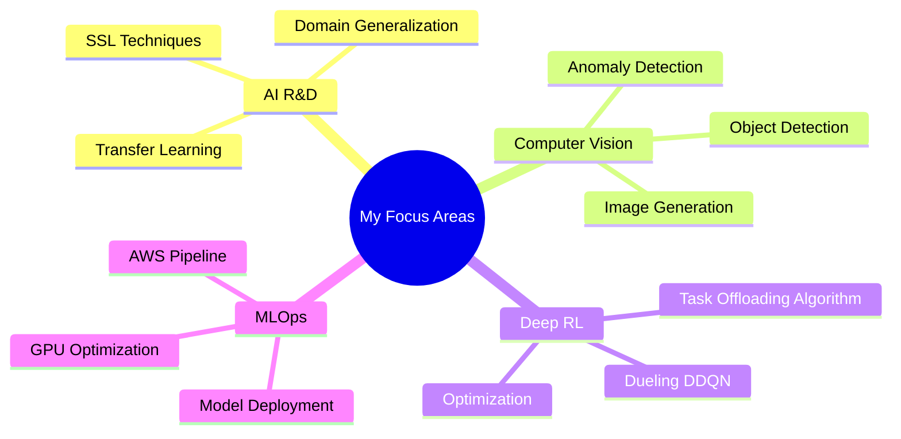

# Hi 👋 I'm Dinuka Madhushan

### 🎓 Final Year @ University of Moratuwa | 🤖 Part Timer @ Pekoe (TeaAI)

---

## 🚀 About Me

Electronic and Telecommunication Engineering undergraduate specializing in **AI/ML and Computer Vision**. Currently working as an **Part Time Employee at Pekoe (TeaAI)**, developing cutting-edge self-supervised learning models and advanced neural network architectures for agricultural AI applications.

- 🎓 **Education:** B.Sc. Electronic & Telecom Engineering | **GPA: 3.65/4.0**
- 📍 **Location:** Moratuwa, Sri Lanka 🇱🇰
- 🔬 **Current Focus:** Deep Reinforcement Learning • Self-Supervised Learning
- 💼 **Worked on:** • Self-Supervised Learning • Generative AI • Computer Vision • Domain Generalization Techniques • Transfer Learning • Various DRL models 
- 🏆 **Educational Achievements:** GPA: 3.65/4.0 (Dean's List (3 semesters)) • Island Rank 64 (A/L) •2 Competition Finals

---

## 💻 Tech Arsenal

<table>
<tr>
<td align="center" width="25%">

 Python
</td>
<td align="center" width="25%">

 C++
</td>
<td align="center" width="25%">

 AWS
</td>
<td align="center" width="25%">

 PyTorch
</td>
</tr>
<tr>
<td align="center" width="25%">

 React
</td>
<td align="center" width="25%">

 OpenCV
</td>
<td align="center" width="25%">

 Altium
</td>
<td align="center" width="25%">

 FastAPI
</td>
</tr>
</table>

---

## 🔥 Featured Projects

| 🤖 AI/ML Projects | 🔧 Engineering Projects |
|:-----------------|:-----------------------|
| **[IoV Task Offloading](https://github.com/DinukaMadhushan1234)**   Dueling DDQN for Digital Twin-based vehicle networks | **[Thermo-Track](https://github.com/DinukaMadhushan1234)**   AI-powered transformer maintenance system |
| **[AWS ML Chatbot](https://github.com/DinukaMadhushan1234)**   Cloud-native NLP pipeline (EC2/Lambda/SageMaker) | **[PLUGSi](https://github.com/DinukaMadhushan1234)**   Smart modular IoT power outlet (IEEE Finalist) |
| **[IEEE VIP Cup 2025](https://github.com/DinukaMadhushan1234)**   YOLOv8 UAV detection with multimodal fusion | **[EcoWatt](https://github.com/DinukaMadhushan1234)**   Real-time energy monitoring platform |
| **[OmniGen Fine-tuning](https://github.com/DinukaMadhushan1234)**   LoRA-based image generation on GPUs | **[WaveHarmony](https://github.com/DinukaMadhushan1234)**   Real-time audio spectrum visualizer |

---

## 📊 GitHub Analytics

 

---

## 🎯 Focus Areas

---

## 💼 Experience & Achievements

<table>
<tr>
<td width="50%">

### 🏢 Professional Experience
- **AI Engineer Intern** @ Pekoe (TeaAI)
  - Self-supervised learning models
  - Agricultural computer vision
  - Price forecasting algorithms
  - PyTorch & CUDA optimization

</td>
<td width="50%">

### 🏆 Key Achievements
- 🥇 Dean's List (3 semesters)
- 🥈 IEEE INSL Finalist 2023
- 🥉 SLIOT Semi-Finalist 2023
- 📜 Oracle AI Certified Professional
- 📜 DeepLearning.AI ML Specialization

</td>
</tr>
</table>

---

## 🌐 Let's Connect!

  

**💡 "Transforming Ideas into Intelligent Solutions"**

